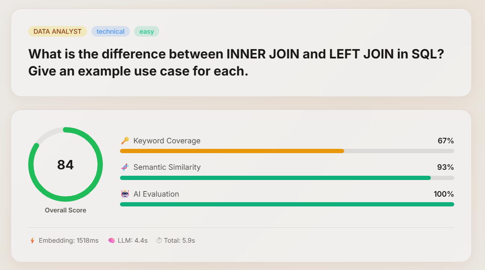
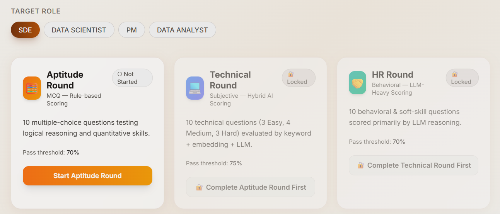
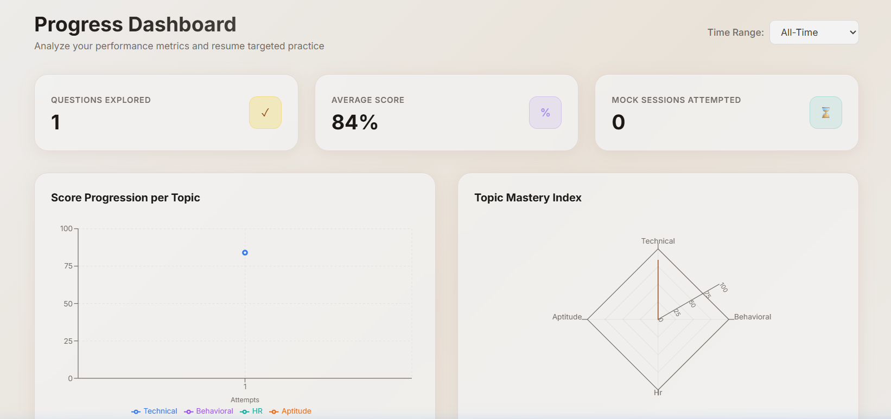

# Mockly — AI-Based Interview Preparation Platform

Mockly is a web-based interview preparation platform designed to help students practice role-specific interview questions and receive highly analytical, personalized feedback. It features a simulated placement gating flow and robust visual progress tracking.

---

## 🚀 Core Value Proposition

Mockly empowers students (especially those preparing for placement rounds) to improve their performance through **hybrid answer evaluation** (combining keyword coverage, semantic vector similarity, and LLM grading) and structured, actionable feedback with a simulated placement gating flow.

---

## 🛠️ Technology Stack

- **Frontend**: React (Vite), Tailwind CSS, Recharts (for charts), Axios (for API communication)
- **Backend**: Node.js, Express, Mongoose (MongoDB ODM)
- **Database**: MongoDB (runs locally)
- **AI Evaluation**: Google Gemini API (`gemini-3.5-flash-lite`, `gemini-3.6-flash`, etc.) & Google Gemini Embeddings (`gemini-embedding-001` / `gemini-embedding-2`)
- **Authentication**: JSON Web Tokens (JWT) for session management, bcryptjs for password hashing

---

## ✨ Key Features

### 1. MERN Monorepo & Auth
- **JWT Authentication**: User signup, login, and session persistence across page refreshes.
- **Role Selection**: Dynamic role definitions including **Software Development Engineer (SDE)**, **Data Scientist**, **Product Manager (PM)**, and **Data Analyst**.

### 2. Practice Mode & Hybrid Evaluation
- Practice single questions with real-time feedback.
- **Weighted Hybrid Scoring System**:
  - **Keyword Matching (25% weight)**: Extracts and matches key points from the answer.
  - **Semantic Vector Embedding (35% weight)**: Calculates cosine similarity using Gemini embeddings.
  - **LLM Assessment (40% weight)**: Grades communication clarity, technical accuracy, and completeness using Google Gemini.
- **Structured Feedback**: Real-time analysis detailing strengths, weaknesses, missing key points, and suggestions.



### 3. Timed Mock Interviews
- Timed 10-question mock sessions (45-minute timer) simulating real-world pressure.
- Real-time countdown timer that auto-submits answers on timeout.
- Dynamic navigation panel and post-session performance report cards.

### 4. Gated 3-Round Placement Simulation
- **Aptitude Round**: MCQ-based test with rule-based scoring (pass threshold is 70/100).
- **Technical Round**: Gated access requiring a passed Aptitude round. Questions are difficulty-balanced (3 easy, 4 medium, 3 hard) with hybrid evaluation.
- **HR Round**: Gated access requiring a passed Technical round. Evaluates communication, behavior, and situational judgment using LLM-heavy grading.
- **Attempt Tracking**: Enforces a strict 3-retry attempt limit per round before locking access.



### 5. Performance Dashboard
- **Topic Radar Chart**: Displays strengths and weaknesses across different modules.
- **Score Line Chart**: Visualizes score trends and progress over time.
- **Stats Cards**: Displays total questions answered, average score, and active mock sessions.
- **Smart Recommendations**: Suggests questions based on the student's weakest topics.



### 6. Admin Panel
- **Protected Access**: REST endpoints and React UI screens restricted to users with the admin role.
- **Question Bank CRUD**: Admin dashboard to add, edit, delete, or bulk-import questions.
- **Role Management**: Easily update, create, or soft-delete dynamic roles.
- **User Progress Logs**: Platform-wide metrics showing student performance averages and activity.

---

## ⚙️ Installation & Setup

### Prerequisites
- [Node.js](https://nodejs.org/) (v18+ recommended)
- [MongoDB Local Community Server](https://www.mongodb.com/try/download/community) (running on `mongodb://localhost:27017`)
- Google Gemini API Key

### Step 1: Install Dependencies
From the repository root, install dependencies for the root, client, and server:
```bash
npm run install-all
```

### Step 2: Configure Environment Variables
Create a `.env` file in the `server/` directory:
```bash
cp server/.env.example server/.env
```

Open `server/.env` and update the variables:
```env
PORT=5000
MONGODB_URI=mongodb://localhost:27017/mockly
JWT_SECRET=your_jwt_secret_here
JWT_EXPIRES_IN=7d

# Gemini API Configuration (can be comma-separated API keys for rotation)
GEMINI_API_KEY=your_gemini_api_key_here
GEMINI_MODEL=gemini-3.6-flash
GEMINI_EMBED_MODEL=gemini-embedding-001
```

### Step 3: Seed the Database
Seed the initial questions and roles into your local MongoDB database:
```bash
cd server
node src/scripts/seed.js
```

### Step 4: Bootstrap an Admin User (Optional)
To log in as an administrator and access the Admin Dashboard:
```bash
node src/scripts/admin_setup.js
```
Follow the prompt/configuration to set up an admin email and password.

---

## 🚦 Running the Application

To start both the client and server concurrently in development mode, run the following command from the root directory:

```bash
npm run dev
```

- **Frontend Client**: `http://localhost:3000` (automatically proxies api requests to port 5000)
- **Backend API Server**: `http://localhost:5000`
